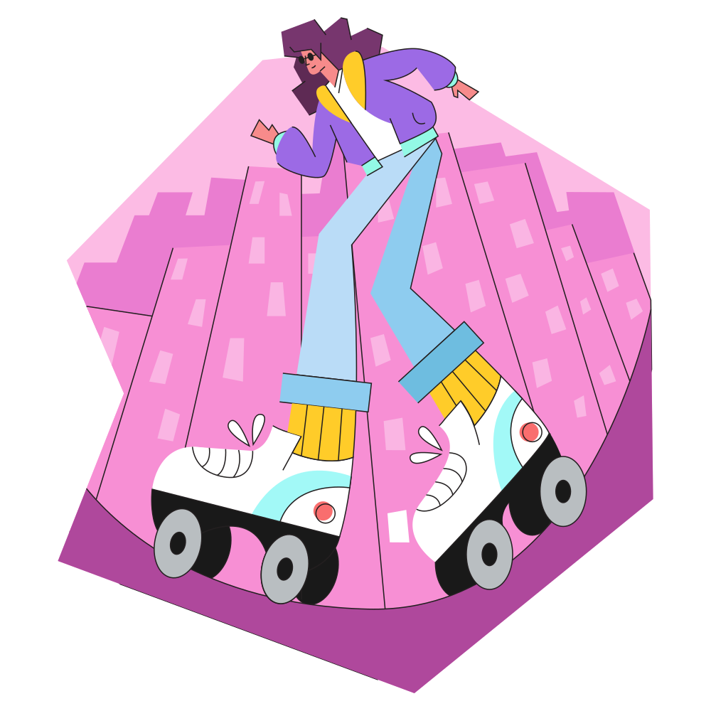
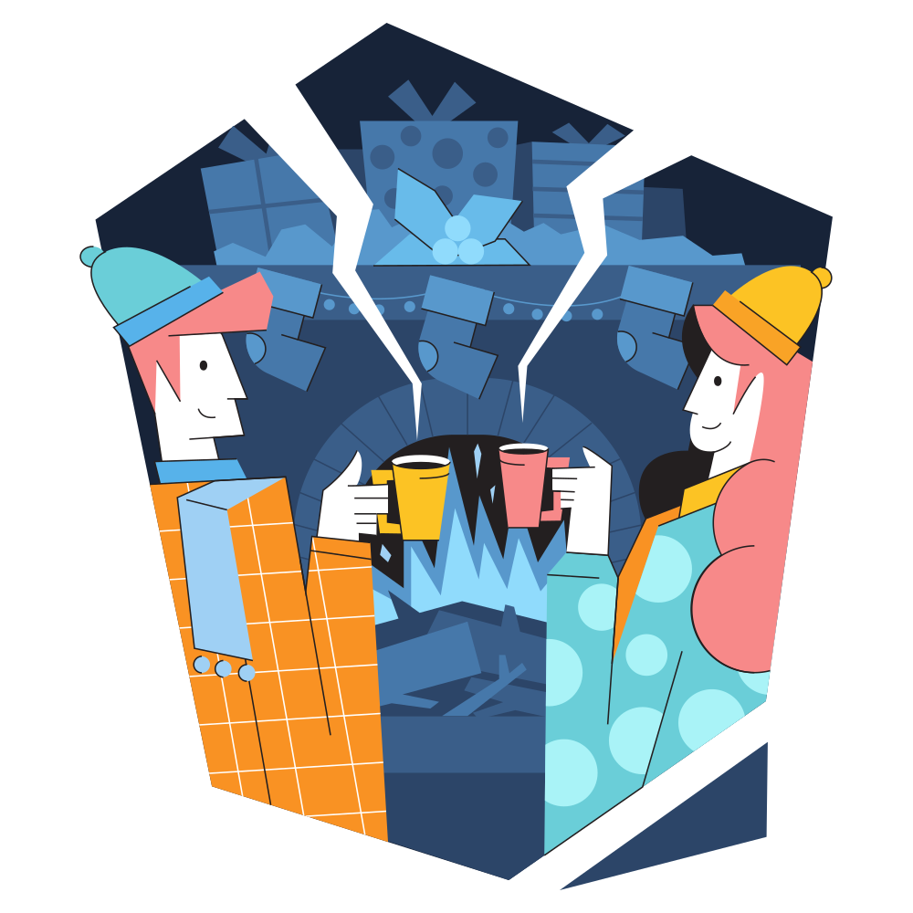
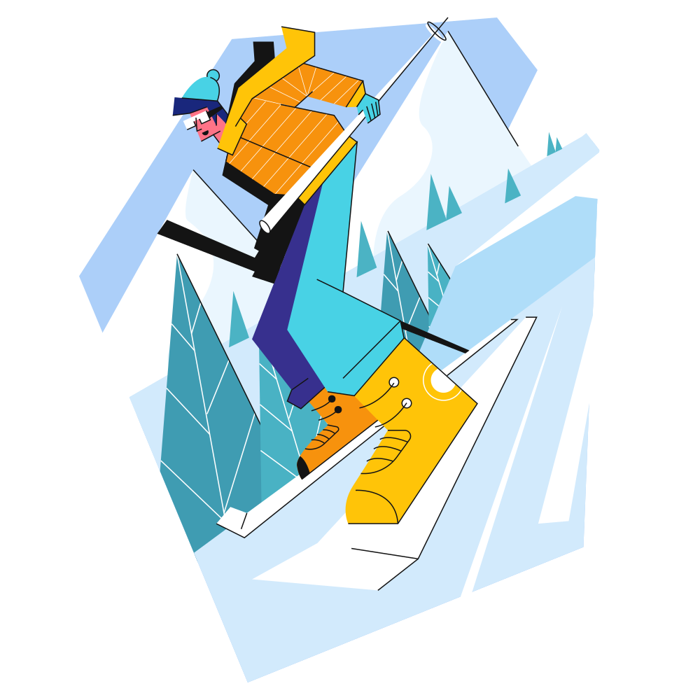
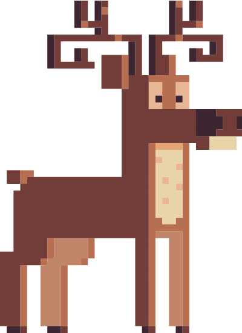
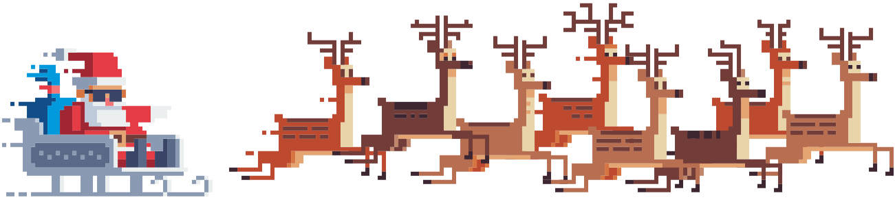

    

###

    

    <h3> 🎁 24 days - 24 coding challenges 🎁</h3>

###

Technical challenge that lasts throughout the month of December alluding to the Christmas holiday. From the 1st to the 24th of December, every day we present a new challenge designed based on the Christmas theme with different levels of difficulty that you will be able to solve using JavaScript or TypeScript.

##

### 🎄 AdventJS Christmas 2022 🎄

<b>Difficulty: </b> 🟢 Easy | 🟠 Medium | 🔴 Hard

🕹️ Challenges

|  #  |                                 Img                                  |                 Title                  | Difficulty |                 Challenge                  |                   Solution                   |
| :-: | :------------------------------------------------------------------: | :------------------------------------: | :--------: | :----------------------------------------: | :------------------------------------------: |
| 01  |   |  Automating Christmas gift wrapping!   |     🟢     | [View](./Challenges-2022/Day-01/README.md) | [View](./Challenges-2022/Day-01/Solution.js) |
| 02  |   |     Nobody wants to work overtime      |     🟢     | [View](./Challenges-2022/Day-02/README.md) | [View](./Challenges-2022/Day-02/Solution.js) |
| 03  |   | ¿How many gift boxes does Santa carry? |     🟢     | [View](./Challenges-2022/Day-03/README.md) | [View](./Challenges-2022/Day-03/Solution.js) |
| 04  |   | A box inside another box and another.. |     🟠     | [View](./Challenges-2022/Day-04/README.md) | [View](./Challenges-2022/Day-04/Solution.js) |
| 05  |   |       Optimizing Santa is trips        |     🔴     | [View](./Challenges-2022/Day-05/README.md) |                  Developing                  |
| 06  |   |     Creating Christmas decorations     |     🟠     | [View](./Challenges-2022/Day-06/README.md) |                  Developing                  |
| 07  |   |       Taking inventory of gifts        |     🟢     | [View](./Challenges-2022/Day-07/README.md) | [View](./Challenges-2022/Day-07/Solution.js) |
| 08  |   |          We need a mechanic!           |     🟠     | [View](./Challenges-2022/Day-08/README.md) |                  Developing                  |
| 09  |   |       The crazy Christmas lights       |     🟢     | [View](./Challenges-2022/Day-09/README.md) |                  Developing                  |
| 10  |  |      Jumping from Santa is sleigh      |     🟠     | [View](./Challenges-2022/Day-10/README.md) |                  Developing                  |
| 11  |  |      Santa Claus is Scrum Master       |     🔴     | [View](./Challenges-2022/Day-11/README.md) |                  Developing                  |
| 12  |  |          Electric sleds, wow!          |     🟠     | [View](./Challenges-2022/Day-12/README.md) |                  Developing                  |
| 13  |  |         Backup Santa is files          |     🟢     | [View](./Challenges-2022/Day-13/README.md) | [View](./Challenges-2022/Day-13/Solution.js) |
| 14  |  |             The best path              |     🟠     | [View](./Challenges-2022/Day-14/README.md) |                  Developing                  |
| 15  |  |     Decorating the Christmas tree      |     🟠     | [View](./Challenges-2022/Day-15/README.md) |                  Developing                  |
| 16  |  |       Arranging Santa is letters       |     🔴     | [View](./Challenges-2022/Day-16/README.md) |                  Developing                  |
| 17  |  |      Carrying the gifts in sacks       |     🟠     | [View](./Challenges-2022/Day-17/README.md) |                  Developing                  |
| 18  |  |           We are out of ink!           |     🟢     | [View](./Challenges-2022/Day-18/README.md) | [View](./Challenges-2022/Day-18/Solution.js) |
| 19  |  |           Sorting the gifts            |     🟢     | [View](./Challenges-2022/Day-19/README.md) | [View](./Challenges-2022/Day-19/Solution.js) |
| 20  |  |         More challenging trips         |     🔴     | [View](./Challenges-2022/Day-20/README.md) |                  Developing                  |
| 21  |  |        Creating the gift table         |     🟠     | [View](./Challenges-2022/Day-21/README.md) |                  Developing                  |
| 22  |  |            Lighting in tune            |     🟢     | [View](./Challenges-2022/Day-22/README.md) |                  Developing                  |
| 23  |  |          Santa Claus compiler          |     🔴     | [View](./Challenges-2022/Day-23/README.md) |                  Developing                  |
| 24  |  |      the last challenge is a maze      |     🔴     | [View](./Challenges-2022/Day-24/README.md) |                  Developing                  |

##

### 🎅 AdventJS Christmas 2023 🎅

<b>Difficulty: </b> 🟢 Easy | 🟠 Medium | 🔴 Hard

🕹️ Challenges

|  #  |                                 Img                                  |             Title             | Difficulty |                 Challenge                  |                   Solution                   |
| :-: | :------------------------------------------------------------------: | :---------------------------: | :--------: | :----------------------------------------: | :------------------------------------------: |
| 01  |    |     First Gift Repeated!      |     🟢     | [View](./Challenges-2023/Day-01/README.md) | [View](./Challenges-2023/Day-01/Solution.js) |
| 02  |    |      We star the factory      |     🟢     | [View](./Challenges-2023/Day-02/README.md) | [View](./Challenges-2023/Day-02/Solution.js) |
| 03  |    |        The naughty elf        |     🟢     | [View](./Challenges-2023/Day-03/README.md) | [View](./Challenges-2023/Day-03/Solution.js) |
| 04  |    |  Turn the parentheses around  |     🟠     | [View](./Challenges-2023/Day-04/README.md) | [View](./Challenges-2023/Day-04/Solution.js) |
| 05  |   |     Santa is cyber truck      |     🟠     | [View](./Challenges-2023/Day-05/README.md) | [View](./Challenges-2023/Day-05/Solution.js) |
| 06  |    |     The reindeer on trial     |     🟢     | [View](./Challenges-2023/Day-06/README.md) | [View](./Challenges-2023/Day-06/Solution.js) |
| 07  |    |         The 3D boxes          |     🟢     | [View](./Challenges-2023/Day-07/README.md) |                  Developing                  |
| 08  |    |     Sorting the warehouse     |     🟠     | [View](./Challenges-2023/Day-08/README.md) | [View](./Challenges-2023/Day-08/Solution.js) |
| 09  |    |       Switch the lights       |     🟢     | [View](./Challenges-2023/Day-09/README.md) | [View](./Challenges-2023/Day-09/Solution.js) |
| 10  |   | Create you own christmas tree |     🟢     | [View](./Challenges-2023/Day-10/README.md) | [View](./Challenges-2023/Day-10/Solution.js) |
| 11  |   |      The studious elves       |     🟠     | [View](./Challenges-2023/Day-11/README.md) | [View](./Challenges-2023/Day-11/Solution.js) |
| 12  |   |      Is it a valid copy?      |     🟠     | [View](./Challenges-2023/Day-12/README.md) | [View](./Challenges-2023/Day-12/Solution.js) |
| 13  |   |     Calculating the time      |     🟢     | [View](./Challenges-2023/Day-13/README.md) | [View](./Challenges-2023/Day-13/Solution.js) |
| 14  |   |        Avoid the alarm        |     🟠     | [View](./Challenges-2023/Day-14/README.md) | [View](./Challenges-2023/Day-14/Solution.js) |
| 15  |   |       Autonomous robot        |     🟠     | [View](./Challenges-2023/Day-15/README.md) | [View](./Challenges-2023/Day-15/Solution.js) |
| 16  |   |       Friday deployment       |     🟢     | [View](./Challenges-2023/Day-16/README.md) |                  Developing                  |
| 17  |   |     Optimizing the rental     |     🟢     | [View](./Challenges-2023/Day-17/README.md) |                  Developing                  |
| 18  |   |       the digital clock       |     🔴     | [View](./Challenges-2023/Day-18/README.md) |                  Developing                  |
| 19  |   |       face the sabotage       |     🟠     | [View](./Challenges-2023/Day-19/README.md) |                  Developing                  |
| 20  |   |     Distribute the weight     |     🔴     | [View](./Challenges-2023/Day-20/README.md) |                  Developing                  |
| 21  |   |        Binary message         |     🟠     | [View](./Challenges-2023/Day-21/README.md) |                  Developing                  |
| 22  |   |     Programming language      |     🟢     | [View](./Challenges-2023/Day-22/README.md) |                  Developing                  |
| 23  |   |       Christmas dinner        |     🟢     | [View](./Challenges-2023/Day-23/README.md) |                  Developing                  |
| 24  |  |      Jump on the stairs       |     🟠     | [View](./Challenges-2023/Day-24/README.md) |                  Developing                  |
| 25  |  |     Calculating distances     |     🟠     | [View](./Challenges-2023/Day-25/README.md) |                  Developing                  |

